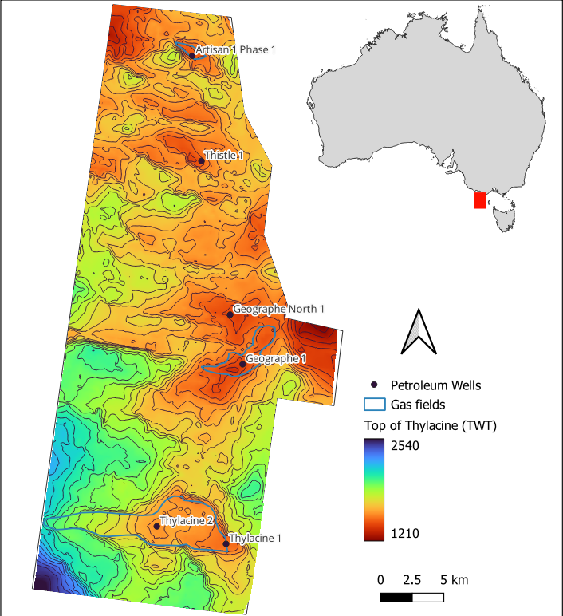

# Transfer Learning with Seismic Attributes

In this post we demonstrate that while computer vision methods are a powerful means for extracting important geological information from geophysical imagery, subject matter expertise is crucial when preparing the images for analysis. Since computer vision methods are highly sensitive to textural variation, subject matter experts should carefully consider how image preparation intends to enhance or alternatively dampen geological features that are of interest. 

To demonstrate, we applied three different treatments to a geophysical image. Each of these images were subjected to the same transformations and feature extraction pipeline. The resulting features were then passed through a dimension reduction and clustering process. The results show that preparation of an image has a profound impact on the quality of extracted features. 

## Image Preparation

For this example we created an attribute extracted from a 3D Marine Seismic data. Seismic data is an ideal dataset for analysing textural variations in geology. Different rock types have different densities, and sound waves emitted by seismic surveys travel through different rock types at different velocities. Together variations in rock density and seismic velocity cause changes in acoustic impedance which manifests as changes in reflectivity in seismic data. Such changes in reflectivity can help to distinguish between different rock types.      

We picked the 'Top of Thylacine' horizon on the Investigator 3D Marine Seismic Survey (MSS), and used the interpretation to create a surface. The Thylacine member represents a regional interface between thick Cretaceous aged marine claystones and the underlying shore-face sandstones. It is the top of a regional reservoir horizon that hosts significant gas resources in offshore Victoria. The Top of Thylacine TWT surfaces is shown in the figure below.  

The interface of the Top of Thylacine surface causes a strong impedance contrast and is clearly discernible in seismic imagery. To generate a textural representation of the reservoir section beneath this surface, the Incoherence attribute was calculated. This attribute is ideal for quantifying and visualising changes in texture likely attributed to changes in facies. Is is derived by quantifying the difference between neighbouring traces. Similar traces have a values of near zero and high values represent traces that are dissimilar. The attribute can therefore highlight boundaries between different rock types and/or faults. https://help.dugeo.com/m/Insight/l/438797-incoherence 

For this experiment three different treatments were applied to the Incoherence attribute. 

1. Rendered as a single-band greyscale image
2. Colours truncated to a range of 0-0.1, the 'Viridis' colour bar was applied and the image rendered as a multi-band RGB
3. Finally, to enhance texture a multi-directional hillshade was applied to the coloured image.

Each of the images were then split into a series of 3264 individual 600x600m tiles.

## Feature Extraction

To capture textural information from the images, each of the 3264 tiles were passed through the pre-trained ResNet50 architecture. Before allowing the architecture to proceed to the final layer and perform classification, weights were extracted from the penultimate layer. Each of the 2064 weights are numerical representations of textural information for each of the image tiles. Assuming that the features are of good quality, these can be used to quantify differences between the image tiles based on texture.     

To pass the images through the Resnet50 architecture some transformations had to be applied. These include re-shaping each tile to 244x244 pixels and in the case of the single band greyscale image, duplication of the bands to mimic a 3 band RGB.

The resulting data to be analysed includes three dataframes, one for each of the image variations. Each of these includes 3264 rows, one for each tile and 2064 columns for each of the textural features extracted by ResNet 50. The feature extraction process has transformed each image tile into a multi-dimensional dataset. 

## Dimension Reduction

To compare the feature sets a process of dimension reduction followed by clustering was performed. The objective was to determine firstly whether textural domains can be distinguished from each of the image variations, and then which of the permutations provide the best representation of the sub-surface and are therefore most useful for distinguishing geological domains in the sub-surface.  

For dimension reduction a process of Principal Component Analysis (PCA) followed by Uniform Manifold and Projection (UMAP) was applied.  

As can be seen below, each of the UMAP representations are slightly different, indicating a difference in the ability for the extracted feature sets to distinguish between textural domains. To assist with comparisons, all tiles that fall within the Thylacine gas field are coloured in red and those associated with the dry well Geographe North-1 are highlighted in purple. The objective of this experiment is not to predict hydrocarbon distribution, but since gas is known to be reservoired within sands of the Thylacine member, this visualisation can assist with identifying textural domains that are associated with sands.

## Unsupervised Machine Learning

After dimension reduction, the Louvain clustering method was implemented in an attempt to distinguish between textural domains. In the visualisation below, the clusters have been re-ordered based on the location of the cluster in UMAP space. Clusters associated with the gas bearing reservoir quality sands have the warmest colour, while those most distant from the gas bearing sands in UMAP space have the coolest colours. 

All of the feature sets seem to have clusters that capture the reservoir sands at Thylacine, but it is difficult to fully assess the differences until the clusters can be visualised and compared spatially. Below is a visualisation of each cluster set across the Investigator survey area. As can be seen, the clusters associated with the Greyscale image seem to be less coherent than the others and do not seem to represent natural geological bodies. The features might be highly effective at detecting gas bearing sands at Thylacine, but would be less successful at the Geographe and Artisan fields. In contrast, the cluster set associated with the coloured RGB image seems to exhibit more coherent geological bodies, but the coloured and hillshaded image shows by far the most coherent geological form. It shows clear boundaries between what is likely sands deposited on the marine shelf with an outboard facies that could represent marine slope muds.

